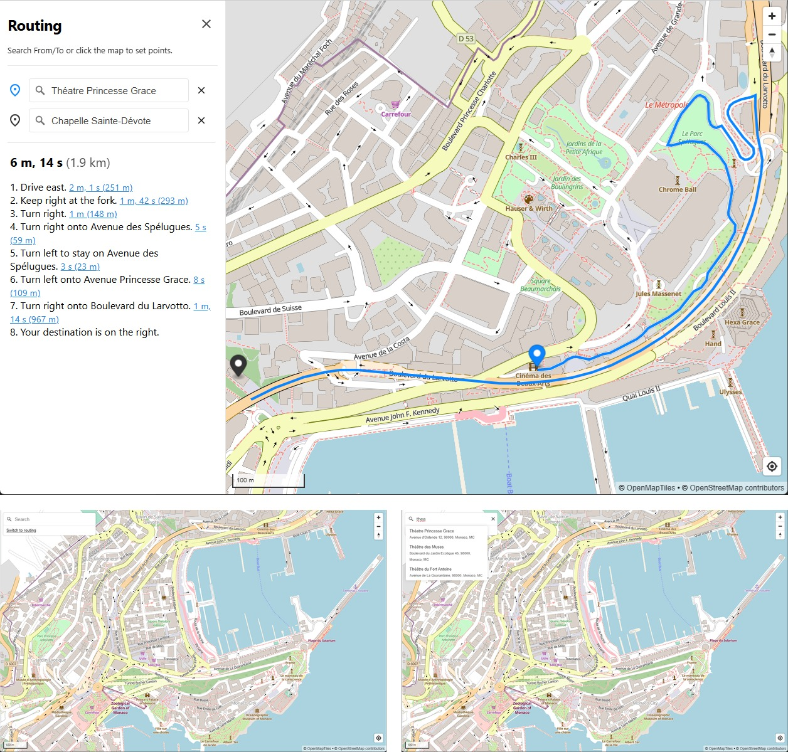

# Corviont Maps – Monaco Demo

Run the [Corviont Maps](https://www.corviont.com) stack locally for a tiny region (Monaco). You’ll get a MapLibre UI, vector tiles, Valhalla routing, and a SQLite-based geocoder (search + reverse geocoding) - **fully offline**, in one Docker Compose stack.



**Need Corviont beyond Monaco (your region + deployment)?** [Join Waitlist](https://www.corviont.com/?utm_source=github&utm_campaign=wave1&utm_content=monaco_top#join-waitlist) (share your region + deployment so we can prioritize the roadmap).

Docs & copy-paste examples: https://www.corviont.com/docs

## Prerequisites

- 64-bit OS (verified on Ubuntu and Raspberry Pi OS)
- Docker [installed](https://docs.docker.com/engine/install/) and running, including Docker Compose

Sanity check:

```bash
# x86_64 or aarch64  => OK
uname -m 

# 64 => OK 
getconf LONG_BIT

# should output versions 
docker version
docker compose version
```

## Quickstart

```bash
git clone https://github.com/corviont/monaco-demo.git
cd monaco-demo

# Choose the port
echo "CORVIONT_PORT=3000" > .env
# (Optional) Allow cross-origin browser apps (comma-separated; use "*" to allow all)
echo "CORVIONT_CORS_ALLOWED_ORIGINS=http://localhost:3001" >> .env

docker compose up -d
```

Open in your browser:

- http://localhost:3000 (replace 3000 if you changed `CORVIONT_PORT`)

Stop:

```bash
docker compose down
```

> Running on another machine? Replace `localhost` with the device IP/hostname.

## What you get

Once the stack is up, it exposes a single HTTP entrypoint on `CORVIONT_PORT`:

- **UI ([MapLibre](https://github.com/maplibre/maplibre-gl-js)):** `/`
- **Tiles ([go-pmtiles](https://github.com/protomaps/go-pmtiles)):** `/tiles/...` (served from a single PMTiles file)
- **Routing gateway ([Valhalla](https://github.com/valhalla/valhalla)):** `/router/route` (other Valhalla endpoints may be present but are experimental)
- **Geocoding:** `/geocoder/search` and `/geocoder/reverse`

After the initial image pulls, the demo runs without any external map/routing APIs.

## Documentation

The full docs include requirements, troubleshooting, and copy-paste examples for:

- Rendering a map (managed style and custom style)
- Routing
- Search and reverse geocoding

**Read the docs here:** https://www.corviont.com/docs

## Join Waitlist

Monaco is the public demo region. If you want Corviont for a different region or deployment (Portainer/Mender/etc.), [Join Waitlist](https://www.corviont.com/?utm_source=github&utm_campaign=wave1&utm_content=monaco_bottom#join-waitlist) or email hello@corviont.com.